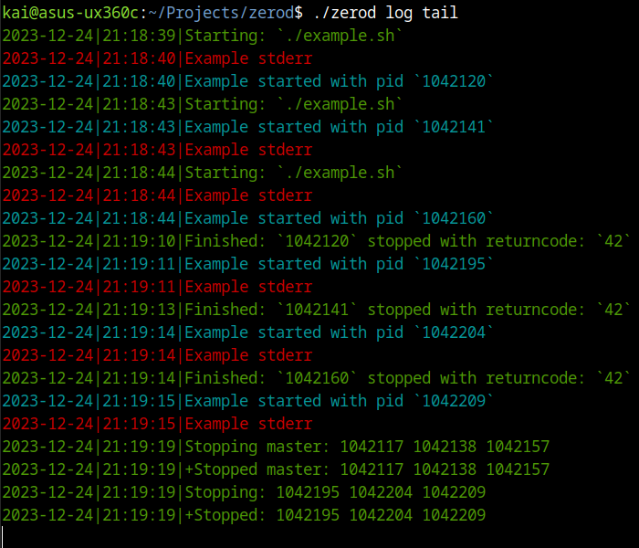

# zerod

Small process control system without master process

This tool is designed for cases when supervisord or systemd is too heavy for you.
It should be interesting for development purpose or in running something
"without obligations"

Should work on Linux and MacOS. It's possible to make it running on other unix

# Usage

Put `zerod` script into your working directory and make it executable

Remember: `zerod` is name-agnostic: you may rename it as you want, or make
its copy or symlink

If you decided to put `zerod` script into your git repository, don't forget to
append your `.gitignore` file with `zerod.temp/` line

## `./zerod init` (getting started)

Let `zerod` to build small example config. It should create `.zerod` directory.
Then you have to open `.zerod` directory and change example `config` file:

### Zerod config

The main variable you have to set is `CMD` variable

Also you may allow `zerod` to run many instancies of `CMD` via setting `MANY=1`

Set `RESTART=1` to make `zerod` restart the process if it was stopped

You may also change other `zerod` variables. Feel free to do it

## `./zerod start`

Just start the `CMD`

## `./zerod stop`

Just stop **all** instancies of `CMD`

## `./zerod restart`

Stops **all** instancies of `CMD` and then starts once

## Zerod logs

Logs are stored in `.zerod/log` file, but I've add useful commands

### `./zerod log tail`

Last log reading

### `./zerod log clear`

Clear old logs

## `./zerod ps`

List of `zerod` controlled processess. Check it after `CMD` changing

## `./zerod run`  # script

You may add your scripts into `.zerod/scripts` directory. Script working
directory will be the same as `./zerod` script is called. Environment variable
`ZEROD` is passed to script referring to previously called `./zerod` script
